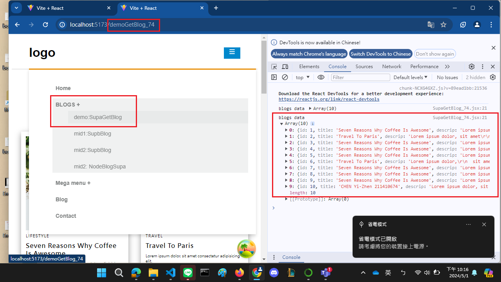
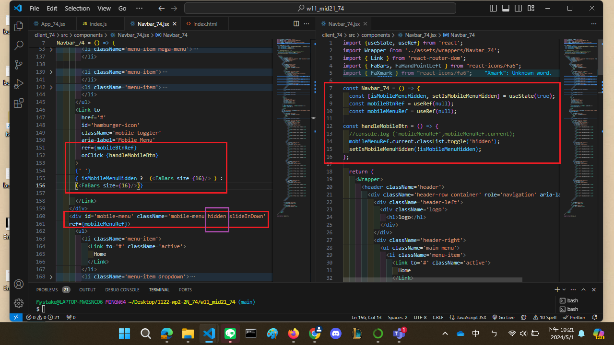
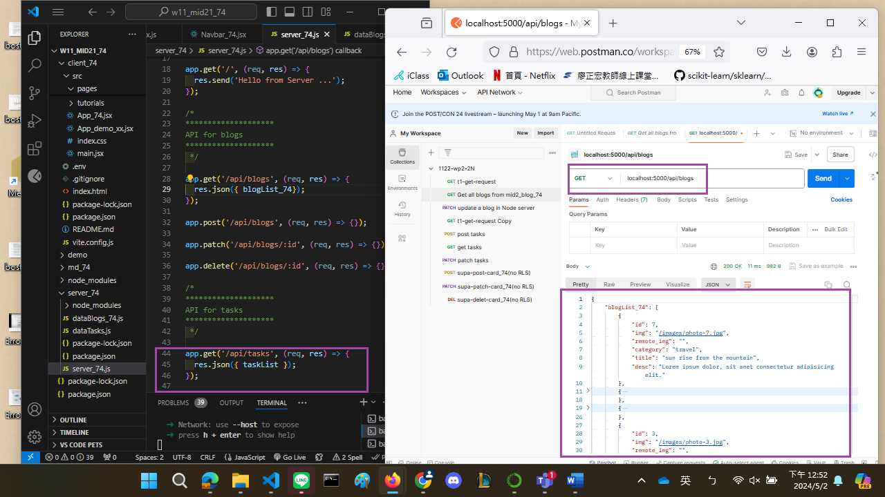
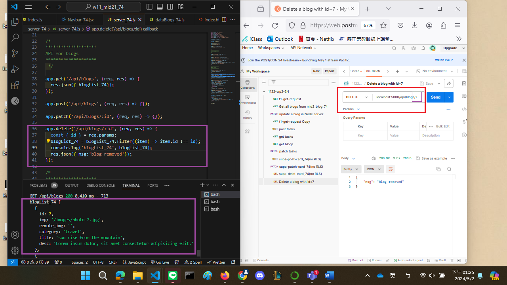
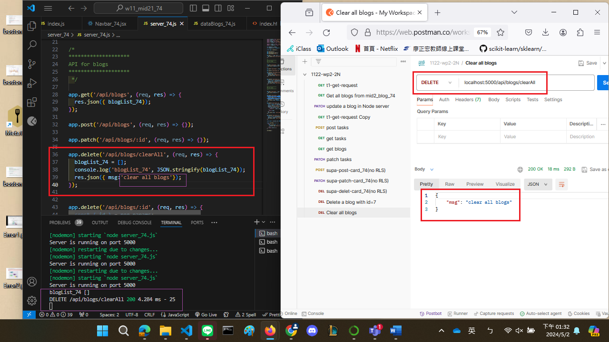
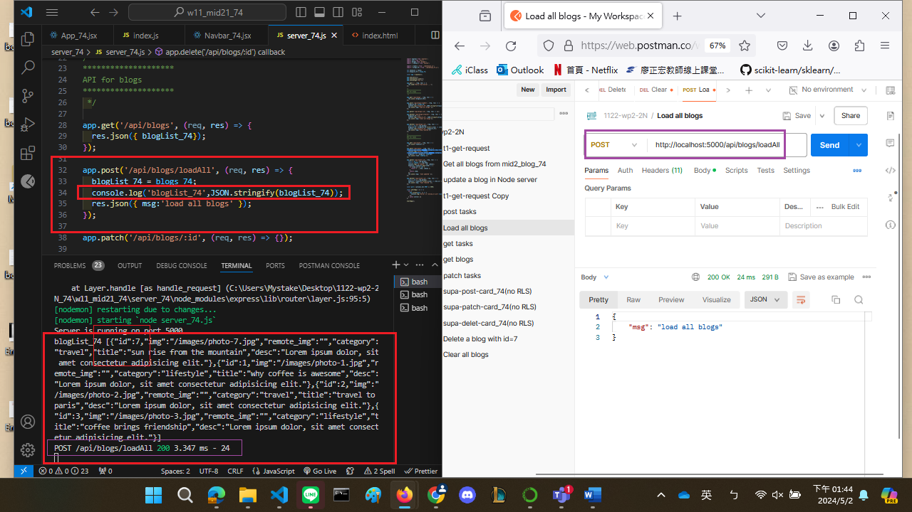

[My github URL](https://github.com/CHEN211410674/1122-wp2-2N_74)

### W11-P1: Make mobileBtn work correctly
 

 


```
3d1b7b7 Chen211410674   Wed May 1 22:24:11 2024 +0800   W11-P1: Make mobileBtn work correctly

```

### W11-P2: Use Postman to test GET /api/blogs, and DELETE /api/blogs/:id
 

 


```
fcc805f Chen211410674   Thu May 2 13:26:27 2024 +0800   W11-P2: Use Postman to test GET /api/blogs, and DELETE /api/blogs/:id 完成
daea42e Chen211410674   Thu May 2 12:55:39 2024 +0800   W11-P2: Use Postman to test GET /api/blogs, and DELETE /api/blogs/:id 完成一半

```

### W11-P3: Use Postman to test DELETE /api/blogs/clearAll, and POST /api/blogs/loadAll
 
#### => test DELETE /api/blogs/clearAll
 

 
#### => test POST /api/blogs/loadAll
 


```
433af83 Chen211410674   Thu May 2 13:47:00 2024 +0800   W11-P3: Use Postman to test DELETE /api/blogs/clearAll, and POST /api/blogs/loadAll

```

### W11-P4: Git logs of W11


```
git log --pretty=format:"%h%x09%an%x09%ad%x09%s" --after="2024-04-30"
 
433af83 Chen211410674   Thu May 2 13:47:00 2024 +0800   W11-P3: Use Postman to test DELETE /api/blogs/clearAll, and POST /api/blogs/loadAll
fcc805f Chen211410674   Thu May 2 13:26:27 2024 +0800   W11-P2: Use Postman to test GET /api/blogs, and DELETE /api/blogs/:id 完成
daea42e Chen211410674   Thu May 2 12:55:39 2024 +0800   W11-P2: Use Postman to test GET /api/blogs, and DELETE /api/blogs/:id 完成一半
3d1b7b7 Chen211410674   Wed May 1 22:24:11 2024 +0800   W11-P1: Make mobileBtn work correctly
 
```