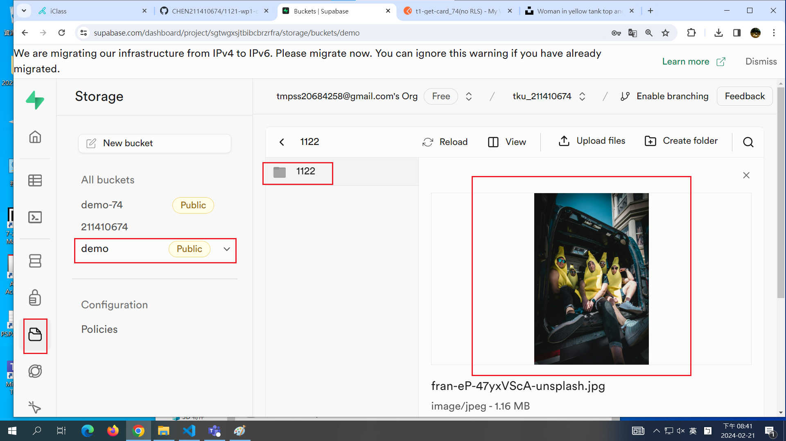
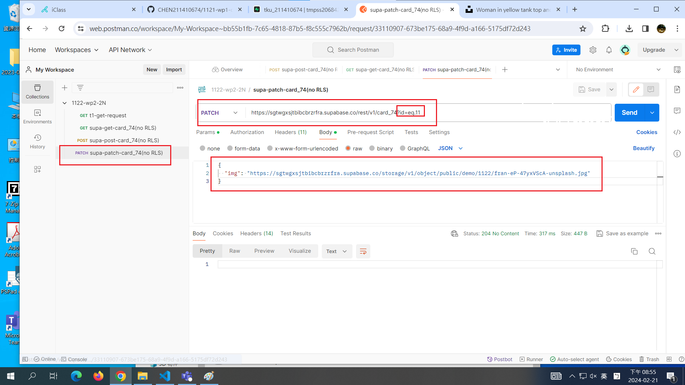
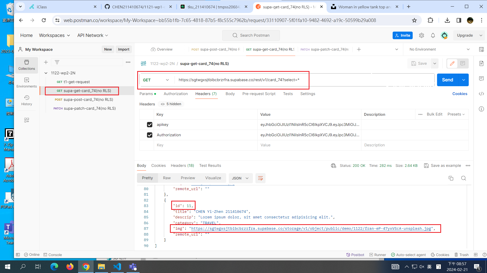
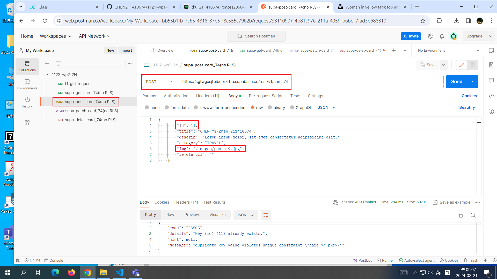
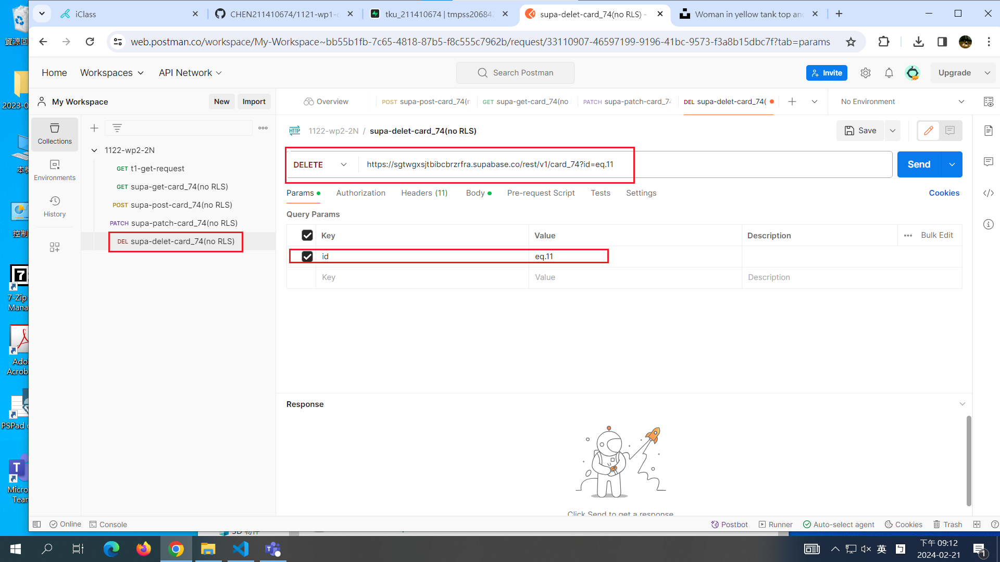
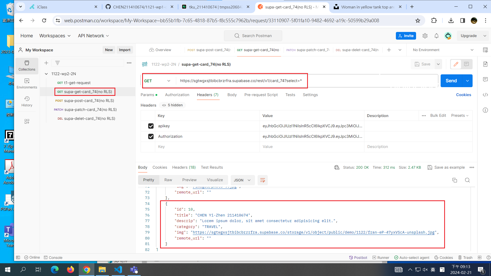
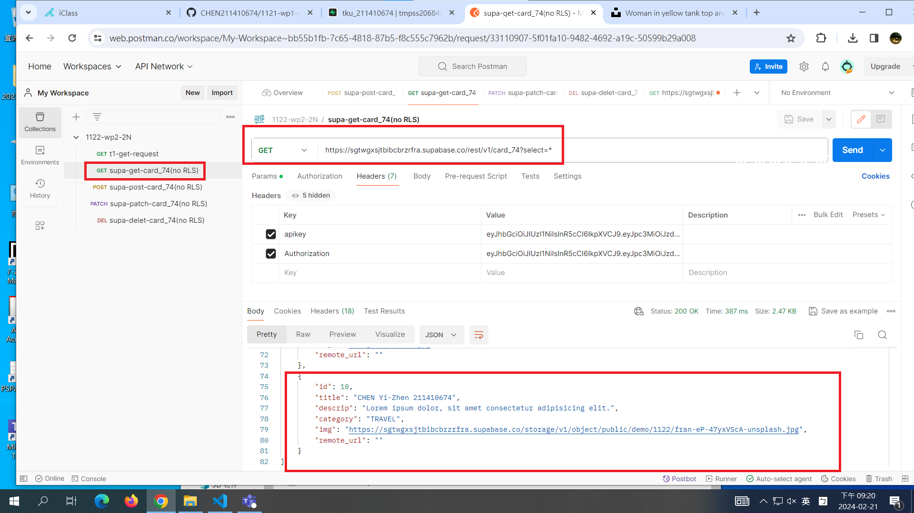

[My github URL](https://github.com/CHEN211410674/1122-wp2-2N_74)

### W1-P1: Get Request demo in Postman


```
16a3c2f Chen211410674   Wed Feb 21 19:22:49 2024 +0800  W1-P1: Get Request demo in Postman
```

### W1-P2: Read card_xx table in Supabase


```
d408bf1 Chen211410674   Wed Feb 21 19:52:41 2024 +0800  W1-P2: Read card_xx table in Supabase
```

### W1-P3: Create a card into card_xx table in Supabase


```
dd09ab0 Chen211410674   Wed Feb 21 20:29:17 2024 +0800  W1-P3: Create a card into card_xx table in Supabase
```

### W1-P4: Update a card in Supabase using remote photo







```
2749368 Chen211410674   Wed Feb 21 20:57:55 2024 +0800  W1-P4: Update a card in Supabase using remote photo
```

### W1-P5: Delete a card in Supabase









### All log

```
3927073 Chen211410674   Wed Feb 21 21:21:37 2024 +0800  W1-P5: Delete a card in Supabase
2749368 Chen211410674   Wed Feb 21 20:57:55 2024 +0800  W1-P4: Update a card in Supabase using remote photo
dd09ab0 Chen211410674   Wed Feb 21 20:29:17 2024 +0800  W1-P3: Create a card into card_xx table in Supabase
364f133 Chen211410674   Wed Feb 21 20:25:47 2024 +0800  W1-P3: Create a card into card_xx table in Supabase
d408bf1 Chen211410674   Wed Feb 21 19:52:41 2024 +0800  W1-P2: Read card_xx table in Supabase
16a3c2f Chen211410674   Wed Feb 21 19:22:49 2024 +0800  W1-P1: Get Request demo in Postman
a92b35a Chen211410674   Wed Feb 21 18:46:50 2024 +0800  w01_74.md
```
