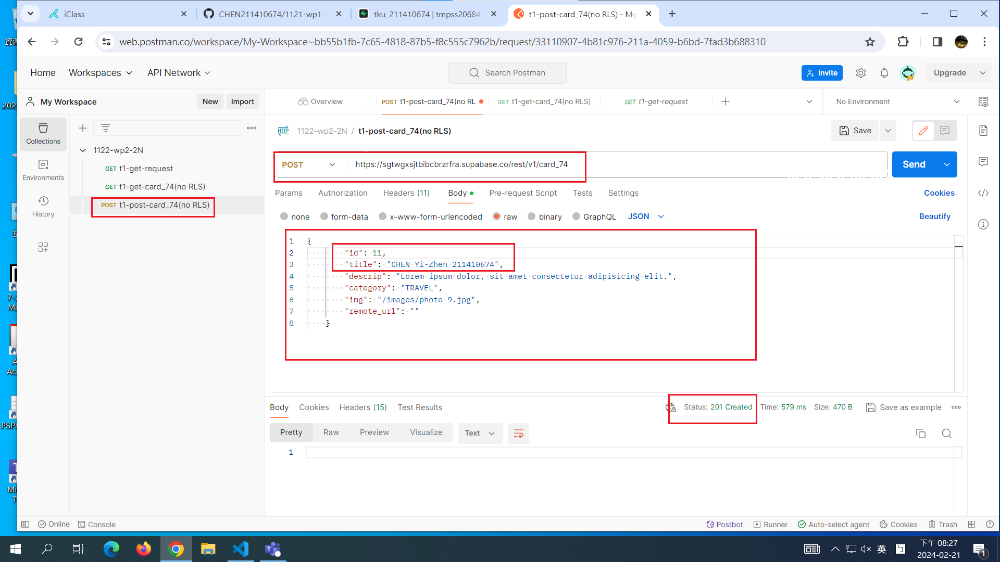

[My github URL](https://github.com/CHEN211410674/1122-wp2-2N_74)

### W1-P1: Get Request demo in Postman


```
16a3c2f Chen211410674   Wed Feb 21 19:22:49 2024 +0800  W1-P1: Get Request demo in Postman
```

### W1-P2: Read card_xx table in Supabase


```
d408bf1 Chen211410674   Wed Feb 21 19:52:41 2024 +0800  W1-P2: Read card_xx table in Supabase
```

### W1-P3: Create a card into card_xx table in Supabase




```
364f133 Chen211410674   Wed Feb 21 20:25:47 2024 +0800  W1-P3: Create a card into card_xx table in Supabase
```
