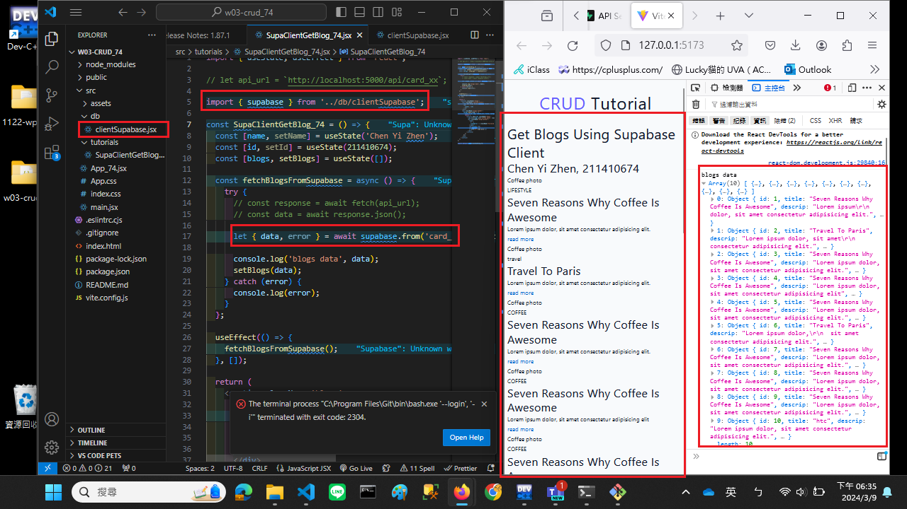
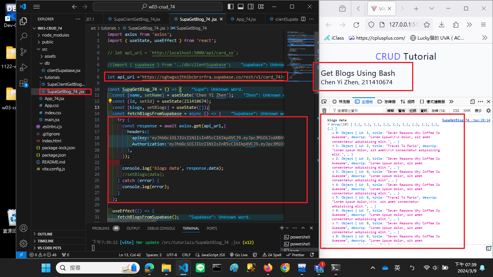
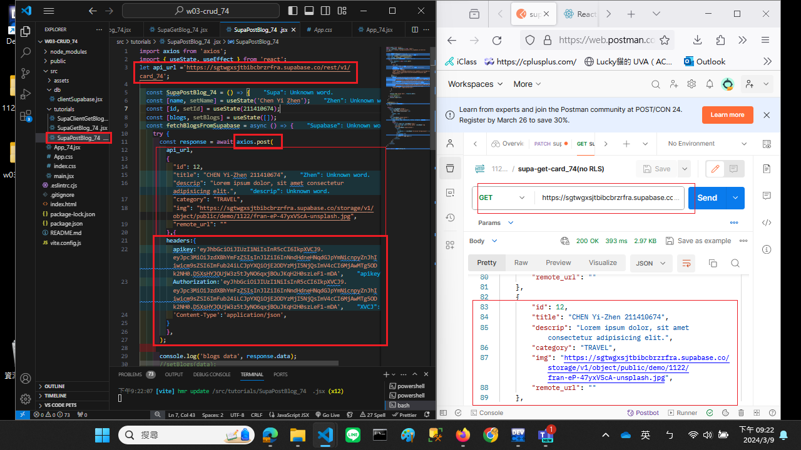
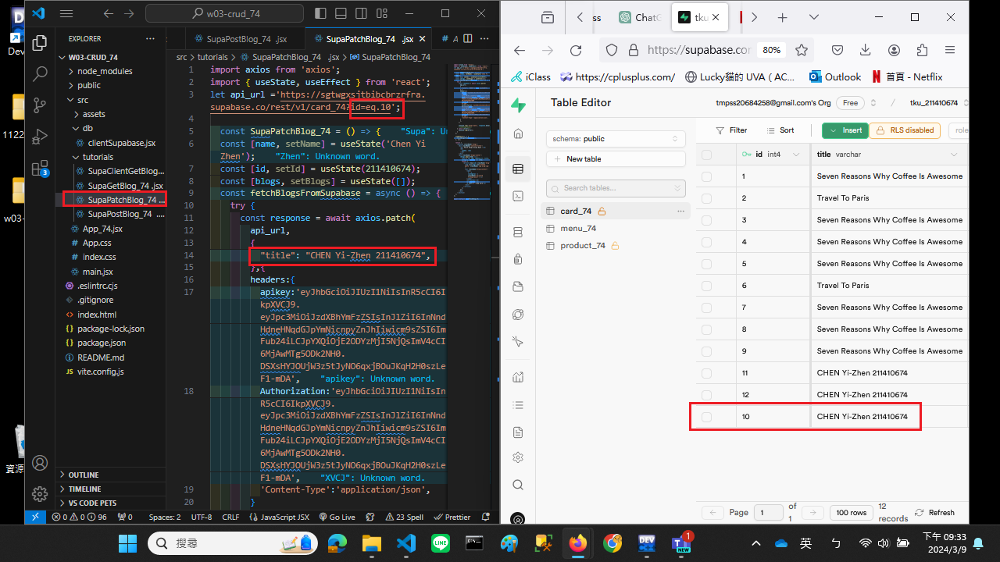
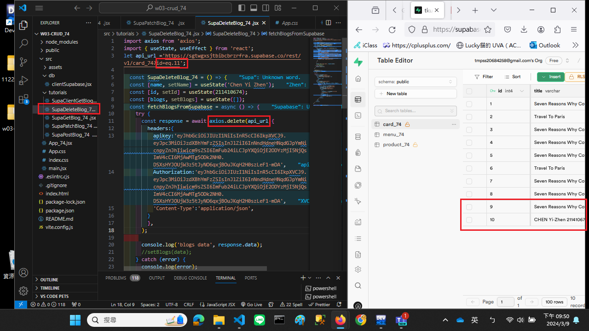

[My github URL](https://github.com/CHEN211410674/1122-wp2-2N_74)

### W3-P1: Use SupaClientGetBlog_74.jsx (supabase client) to get card_74 data


```
e1e7b8b Chen211410674   Sat Mar 9 18:39:49 2024 +0800   W3-P1: Use SupaClientGetBlog_xx.jsx (supabase client) to get card_xx data
```

### W3-P2: Use SupaGetBlog_74.jsx to get card_74 data


```
b57792d Chen211410674   Sat Mar 9 20:55:21 2024 +0800   W3-P2: Use SupaGetBlog_74.jsx to get card_74 data

```

### W3-P3: Use SupaPostBlog_74.jsx to add blog data
 


```
a9dd254 Chen211410674   Sat Mar 9 21:24:45 2024 +0800   W3-P3: Use SupaPostBlog_74.jsx to add blog data
```

### W3-P4: Use SupaPatchBlog_74.jsx to modify blog data
 


```
4f354bc Chen211410674   Sat Mar 9 21:36:07 2024 +0800   W3-P4: Use SupaPatchBlog_74.jsx to modify blog data

```

### W3-P5: Use SupaDeleteBlog_74.jsx to delete blog data
 


```
7db3968 Chen211410674   Sat Mar 9 21:52:44 2024 +0800   W3-P5: Use SupaDeleteBlog_74.jsx to delete blog data

```

### W3-P6: Git logs of W3

```

7db3968 Chen211410674   Sat Mar 9 21:52:44 2024 +0800   W3-P5: Use SupaDeleteBlog_74.jsx to delete blog data
4f354bc Chen211410674   Sat Mar 9 21:36:07 2024 +0800   W3-P4: Use SupaPatchBlog_74.jsx to modify blog data
a9dd254 Chen211410674   Sat Mar 9 21:24:45 2024 +0800   W3-P3: Use SupaPostBlog_74.jsx to add blog data
b57792d Chen211410674   Sat Mar 9 20:55:21 2024 +0800   W3-P2: Use SupaGetBlog_74.jsx to get card_74 data
23664c7 Chen211410674   Sat Mar 9 19:41:56 2024 +0800   W3-P2: Use SupaGetBlog_74.jsx to get card_74 data
e1e7b8b Chen211410674   Sat Mar 9 18:39:49 2024 +0800   W3-P1: Use SupaClientGetBlog_xx.jsx (supabase client) to get card_xx data
48f9b58 Chen211410674   Sat Mar 9 18:39:14 2024 +0800   W3-P1: Use SupaClientGetBlog_xx.jsx (supabase client) to get card_xx data

```