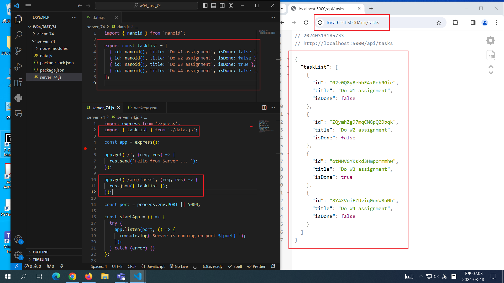
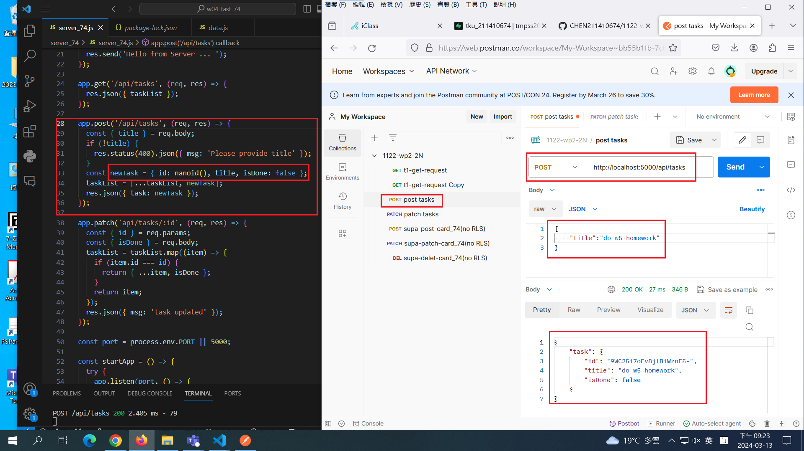

[My github URL](https://github.com/CHEN211410674/1122-wp2-2N_74)

### W4-P1: Server: implement GET /api/tasks



```
179c751 Chen211410674   Wed Mar 13 19:08:44 2024 +0800  W4-P1: Server: implement GET /api/tasks~
```

### W4-P2: Server: implement POST /api/tasks



```

8897ad5 Chen211410674   Wed Mar 13 21:25:18 2024 +0800  W4-P2: Server: implement POST /api/tasks1~
```

### W4-P3: Server: implement PATCH /api/tasks/:id


```
620f66f Chen211410674   Wed Mar 13 22:25:18 2024 +0800  W4-P3: Server: implement PATCH /api/tasks/:id
```

### All logs


```
620f66f Chen211410674   Wed Mar 13 22:25:18 2024 +0800  W4-P3: Server: implement PATCH /api/tasks/:id
8897ad5 Chen211410674   Wed Mar 13 21:25:18 2024 +0800  W4-P2: Server: implement POST /api/tasks1~
179c751 Chen211410674   Wed Mar 13 19:08:44 2024 +0800  W4-P1: Server: implement GET /api/tasks~

```
