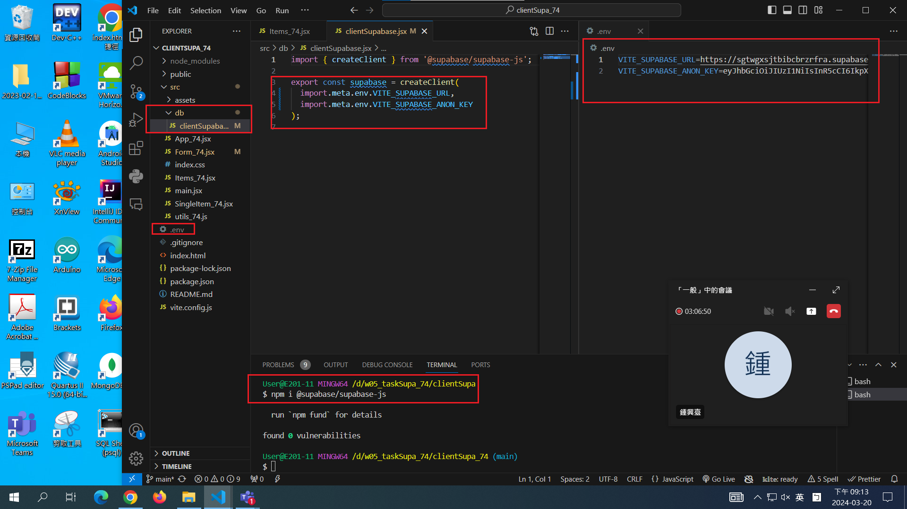
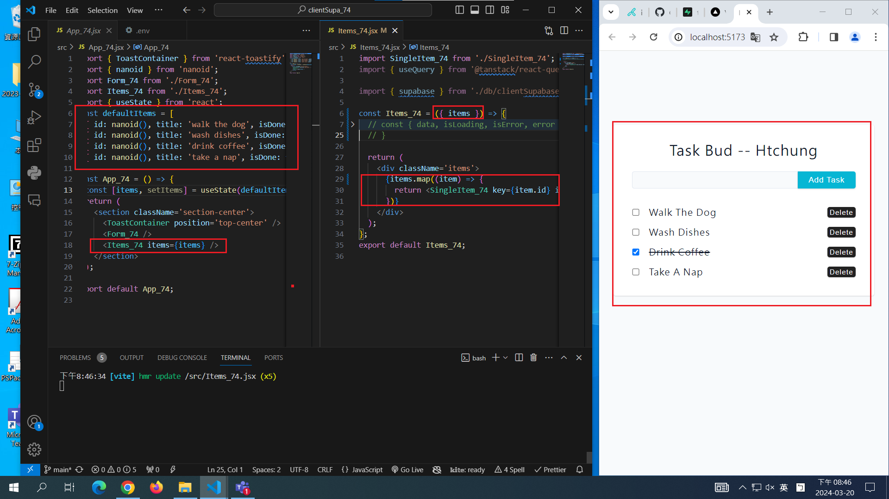
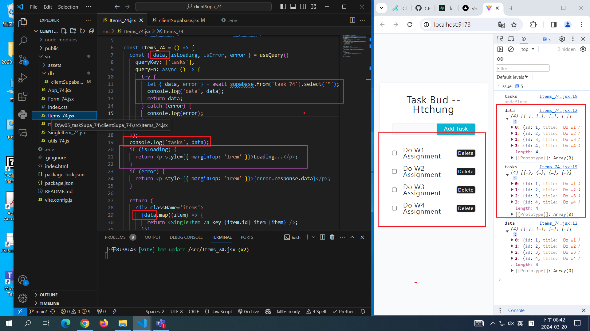
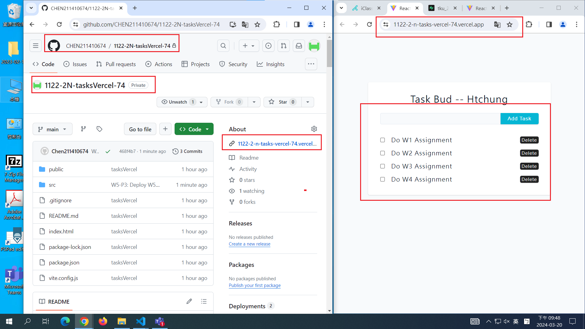
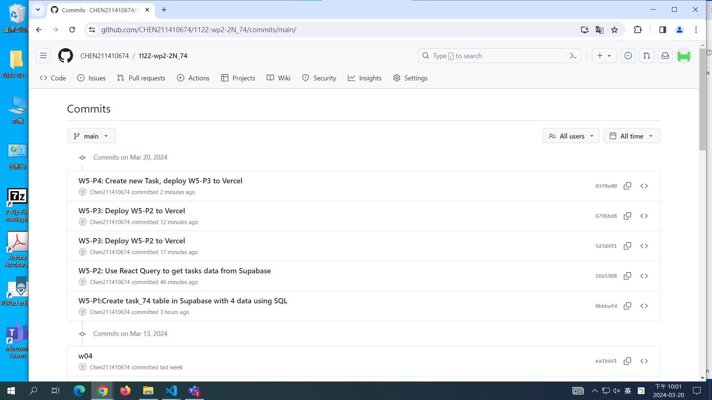

[My github URL](https://github.com/CHEN211410674/1122-wp2-2N_74)

### W5-P1:Create task_74 table in Supabase with 4 data using SQL


```
git log --pretty=format:"%h%x09%an%x09%ad%x09%s" --after="2024-03-19"
```

### W5-P2: Use React Query to get tasks data from Supabase







```
56b5908 Chen211410674   Wed Mar 20 21:15:33 2024 +0800  W5-P2: Use React Query to get tasks data from Supabase
```

### W5-P3: Deploy W5-P2 to Vercel



```
5d3d491 Chen211410674   Wed Mar 20 21:44:21 2024 +0800  W5-P3: Deploy W5-P2 to Vercel

```

### W5-P4: Create new Task, deploy W5-P3 to Vercel

#### => local


#### => vercel


```
03f8e00 Chen211410674   Wed Mar 20 21:59:43 2024 +0800  W5-P4: Create new Task, deploy W5-P3 to Vercel

```

### W5-P5: Git logs of W5



```
03f8e00 Chen211410674   Wed Mar 20 21:59:43 2024 +0800  W5-P4: Create new Task, deploy W5-P3 to Vercel
6796bd8 Chen211410674   Wed Mar 20 21:50:01 2024 +0800  W5-P3: Deploy W5-P2 to Vercel
5d3d491 Chen211410674   Wed Mar 20 21:44:21 2024 +0800  W5-P3: Deploy W5-P2 to Vercel
56b5908 Chen211410674   Wed Mar 20 21:15:33 2024 +0800  W5-P2: Use React Query to get tasks data from Supabase
0bbbafd Chen211410674   Wed Mar 20 18:42:22 2024 +0800  W5-P1:Create task_74 table in Supabase with 4 data using SQL
```
