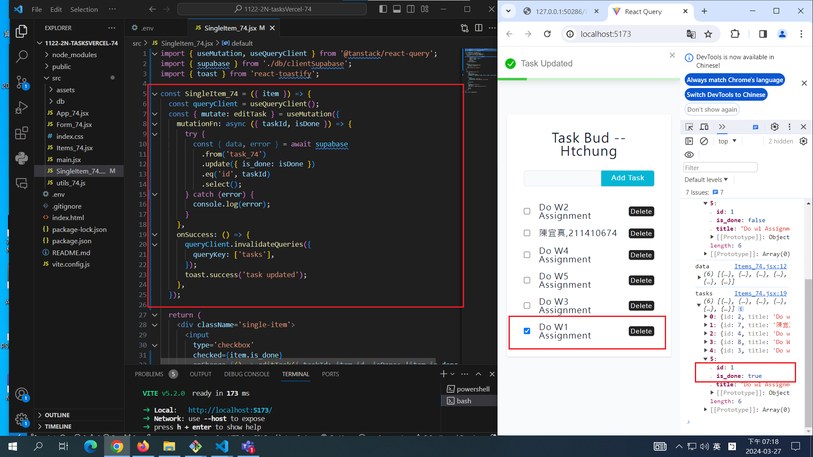

[My github URL](https://github.com/CHEN211410674/1122-wp2-2N_74)

### W6-P1: Update a task in Supabase



```
cc7abc4 Chen211410674   Wed Mar 27 19:20:53 2024 +0800  W6-P1: Update a task in Supabase

```

### W6-P2: Delete a task in Supabase

#### => local


```
de8ec25 Chen211410674   Wed Mar 27 20:11:47 2024 +0800  W6-P2: Delete a task in Supabase

```

#### => Vercel: insert a task, edit the task, delete the task


### W6-P3: Get all tasks from node server


```
4575568 Chen211410674   Wed Mar 27 21:08:45 2024 +0800  W6-P3: Get all tasks from node server

```

### W6-P4: Insert a task into node server


```
e1bd71d Chen211410674   Thu Mar 28 20:29:26 2024 +0800  W6-P4: Insert a task into node server

```

### W6-P5: Git logs of W6

```
e1bd71d Chen211410674   Thu Mar 28 20:29:26 2024 +0800  W6-P4: Insert a task into node server
deec98c Chen211410674   Wed Mar 27 22:17:03 2024 +0800  w06
4575568 Chen211410674   Wed Mar 27 21:08:45 2024 +0800  W6-P3: Get all tasks from node server
de8ec25 Chen211410674   Wed Mar 27 20:11:47 2024 +0800  W6-P2: Delete a task in Supabase
cc7abc4 Chen211410674   Wed Mar 27 19:20:53 2024 +0800  W6-P1: Update a task in Supabase

```
