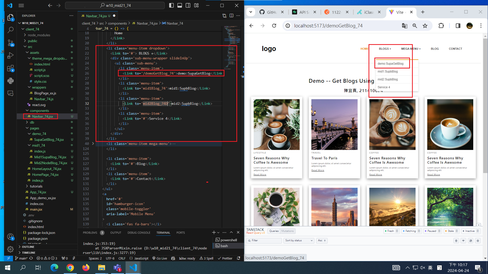
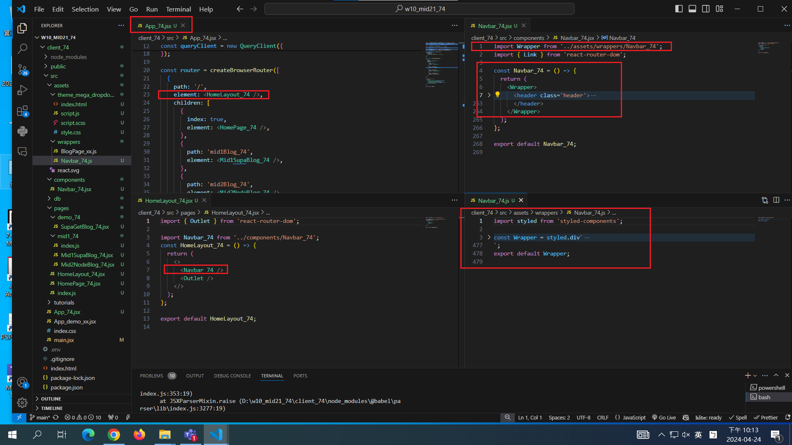
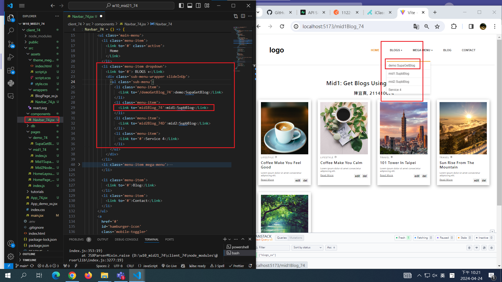
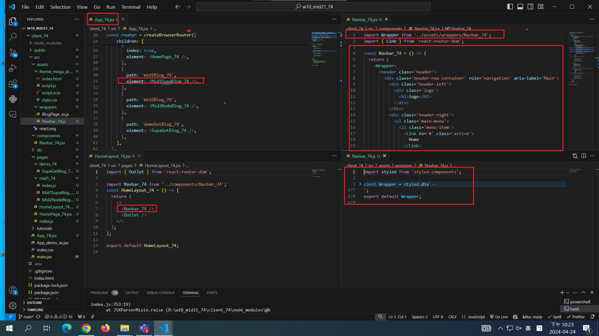

[My github URL](https://github.com/CHEN211410674/1122-wp2-2N_74)

### W10-P1: Create HomeLayout_74 for all routes

### W10-P2: Add Navbar_74 with 3 menu items

### W10-P3: Get all blogs using route /mid1Blog_74 (自行完成)

