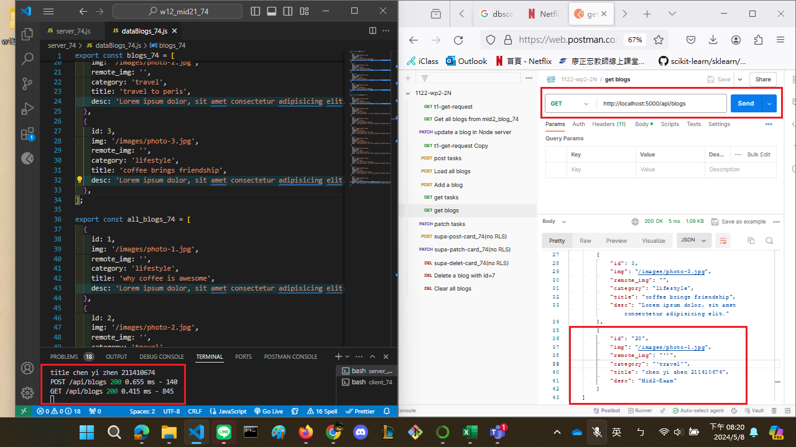
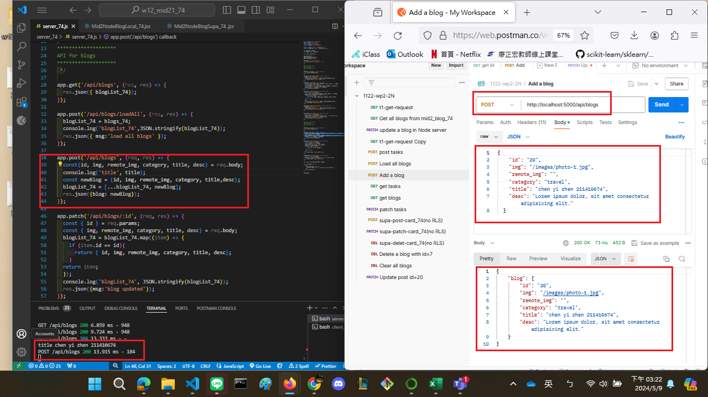
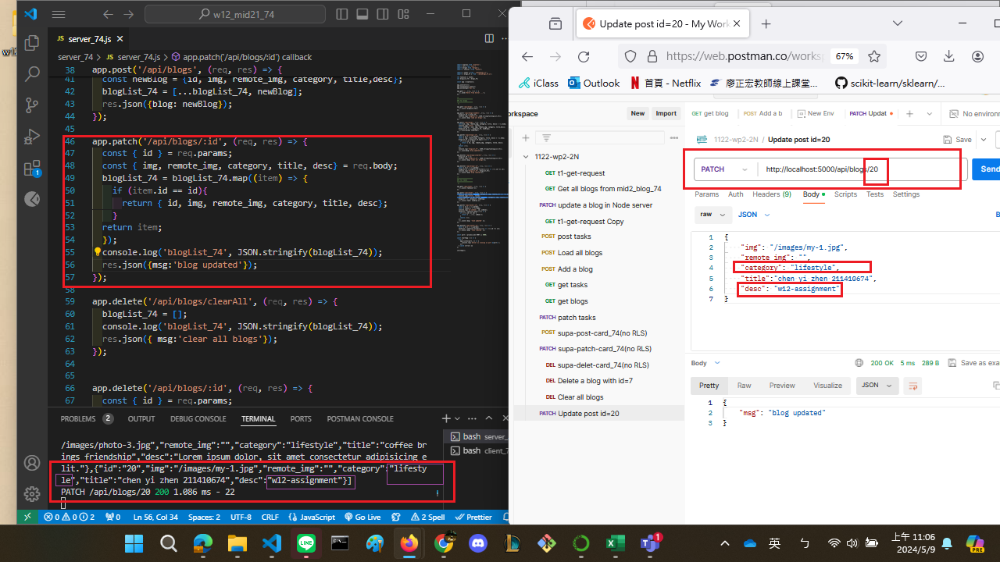
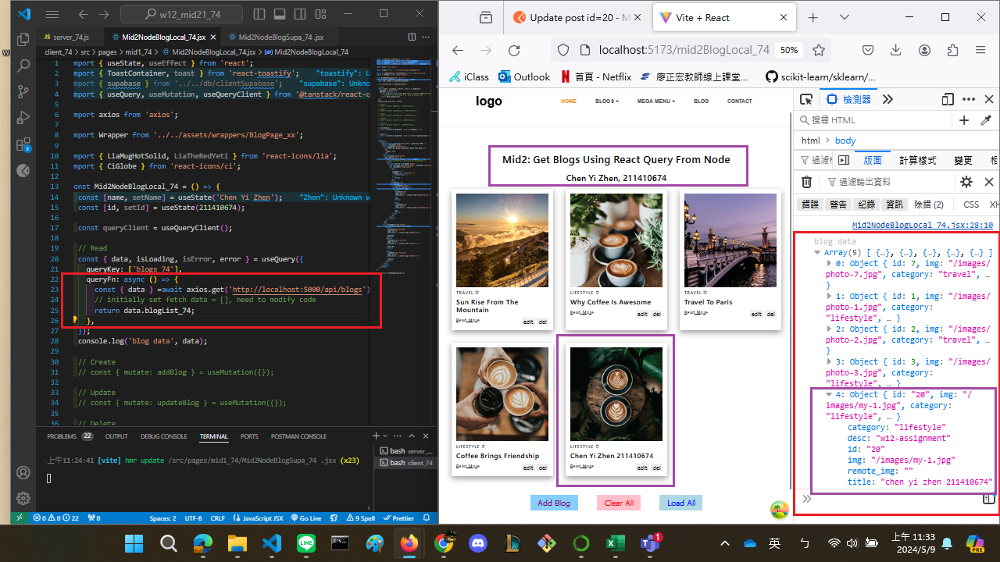
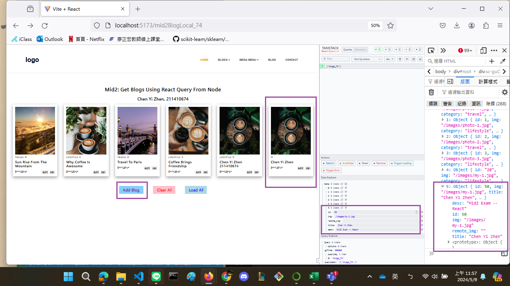
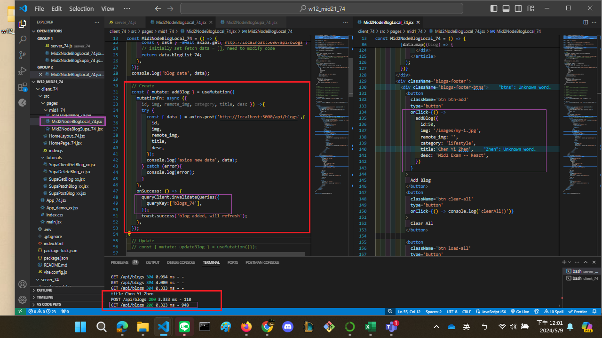

[My github URL](https://github.com/CHEN211410674/1122-wp2-2N_74)

### W12-P1: Insert a blog using local json array
 
 

 

```
b8a2ba8 Chen211410674   Wed May 8 20:26:14 2024 +0800   W12-P1: Insert a blog using local json array
W12-P1: Insert a blog using local json array補上第二張post的圖

```

### W12-P2: Update a blog with id=20
 


```
4289168 Chen211410674   Thu May 9 11:11:35 2024 +0800   W12-P2: Update a blog with id=20

```

### W12-P3: Use React Query to read all blogs from Node server
 


```
d471c0b Chen211410674   Thu May 9 11:35:40 2024 +0800   W12-P3: Use React Query to read all blogs from Node server

```

### W12-P4: Insert a blog using React Query
 

 


```
c81f09c Chen211410674   Thu May 9 12:03:36 2024 +0800   W12-P4: Insert a blog using React Query

```

### W12-P5: Git logs of W11

```

git log --pretty=format:"%h%x09%an%x09%ad%x09%s" --after="2024-05-07"
ad29ab6 Chen211410674   Thu May 9 15:26:23 2024 +0800         W12-P1: Insert a blog using local json array補上第二張post的圖
c81f09c Chen211410674   Thu May 9 12:03:36 2024 +0800         W12-P4: Insert a blog using React Query
d471c0b Chen211410674   Thu May 9 11:35:40 2024 +0800         W12-P3: Use React Query to read all blogs from Node server
4289168 Chen211410674   Thu May 9 11:11:35 2024 +0800         W12-P2: Update a blog with id=20

```