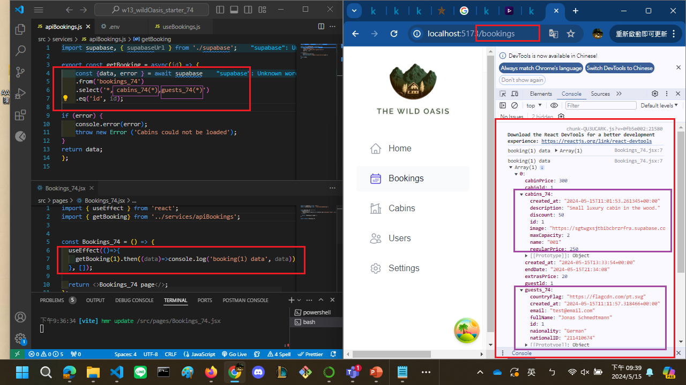

[My github URL](https://github.com/CHEN211410674/1122-wp2-2N_74)

W13-P1: Get first Cabins_74 data from Supabase
 

### W13-P2: Get first booking_xx data, with corresponding cabin_xx and guest_74 data
 

