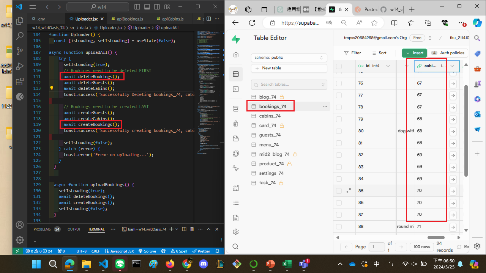
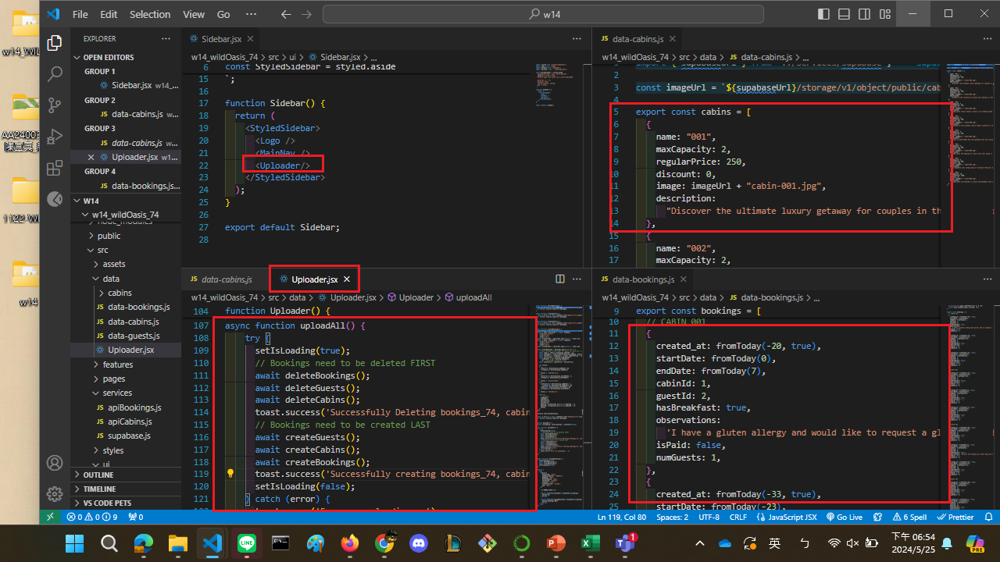
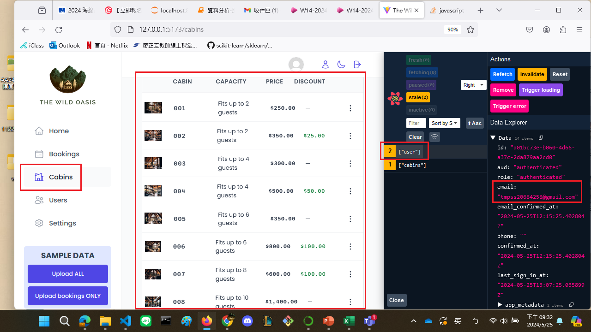
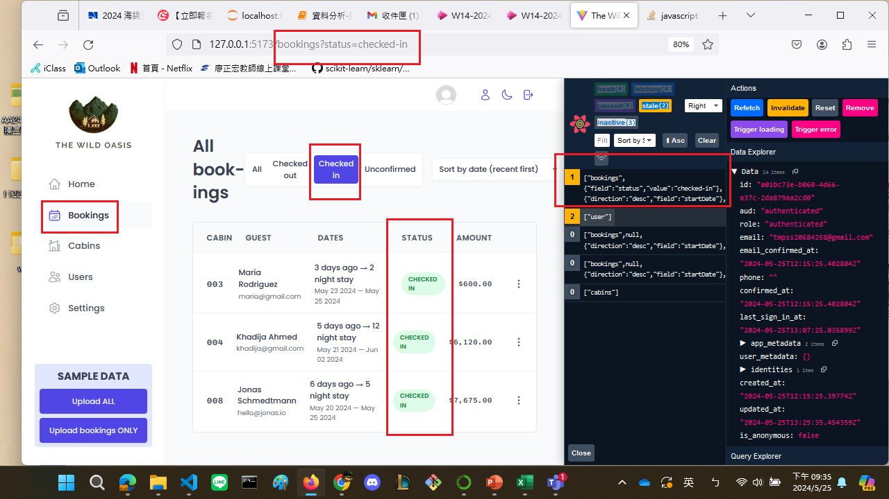

[My github URL](https://github.com/CHEN211410674/1122-wp2-2N_74)


### W14-P1: Use sql to create schemas of cabins_74, guests_74, bookings_74, settings_74, and use Uploader to upload all data


 

 

 


### W14-P2: Make jonas code work, and show cabins and bookings info
 

 


```
5228170 Chen211410674   Sat May 25 18:56:55 2024 +0800  Use sql to create schemas of cabins_74, guests_74, bookings_74, settings_74, and use Uploader to upload all data完成後兩小題
f639b21 Chen211410674   Sat May 25 18:35:22 2024 +0800  Use sql to create schemas of cabins_74, guests_74, bookings_74, settings_74, and use Uploader to upload all data

```

### W14-P2: Make jonas code work, and show cabins and bookings info
 

 


```
a66e354 Chen211410674   Sat May 25 21:43:10 2024 +0800   W14-P2: Make jonas code work, and show cabins and bookings info

```

### W14-P3: Git logs of W14
 
```
git log --pretty=format:"%h%x09%an%x09%ad%x09%s" --after="2024-05-24"

a66e354 Chen211410674   Sat May 25 21:43:10 2024 +0800   W14-P2: Make jonas code work, and show cabins and bookings info
5228170 Chen211410674   Sat May 25 18:56:55 2024 +0800  Use sql to create schemas of cabins_74, guests_74, bookings_74, settings_74, and use Uploader to upload all data完成後兩小題
f639b21 Chen211410674   Sat May 25 18:35:22 2024 +0800  Use sql to create schemas of cabins_74, guests_74, bookings_74, settings_74, and use Uploader to upload all data

```