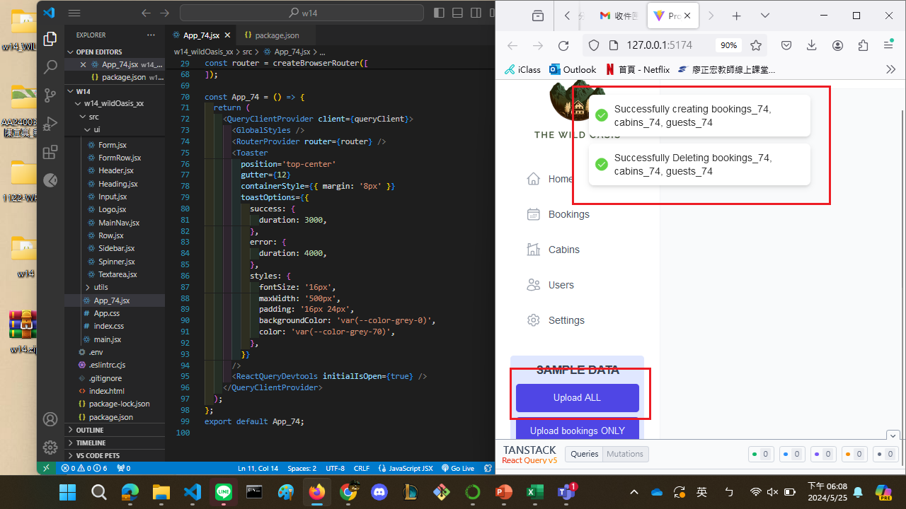

[My github URL](https://github.com/CHEN211410674/1122-wp2-2N_74)

### W14-P1: Use sql to create schemas of cabins_74, guests_74, bookings_74, settings_74, and use Uploader to upload all data

 

 

 

### W14-P2: Make jonas code work, and show cabins and bookings info
 

 

### W14-P2: Make jonas code work, and show cabins and bookings info
 

 
