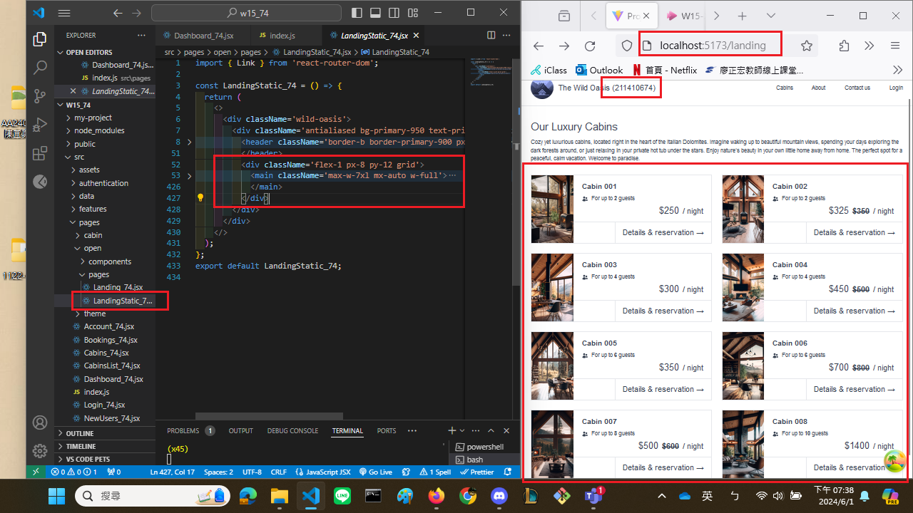

[My github URL](https://github.com/CHEN211410674/1122-wp2-2N_74)

### W15-P1: Show static page <LandingStatic_74 /> using route /landing
 

### W15-P2: For landing page, get 8 cabins data from Supabase
 

### W15-P3:for w15-p3

